# Portfolio Optimization and Stock Prediction
Members: Olaolu Dada | Eric Shavkin | Dom Fernando | Logan Drawdy | Alek Kaluza

## Introduction / Background
With new technologies, many financial institutions are adopting machine learning to mitigate human error in computation and, in turn, maximize profits while minimizing risk of loss creating investment portfolios. We will be using datasets on historical stock prices from Yahoo! Finance API to derive financial indicators such as cumulative return, portfolio risk metrics, and more for performance prediction and portfolio optimization (Wu, Wang, Wu, 2022).

## Problem Definition
Our goal is to learn about potential methods used to analyze and predict stock behavior. We plan to find gaps in current research, particularly the use of clustering to derive optimal investment portfolios. Markowitz’s mean-variance portfolio is today’s standard optimization technique but it cannot help individuals determine what investments to make from a large pool of stocks (Wu, Wang, Wu, 2022). We want to try and bridge this gap by combining financial computations such as mean-variance and Sharpe Ratio with unsupervised learning techniques. Furthermore, we plan to use supervised learning techniques to predict portfolio performance over time, looking at areas of higher risk of loss and attempting to find ways to hedge this loss. The problem with many common predictive models being applied to the market is trying to fit a linear model to a non-linear reality.

## Data Collection and Feature Creation
After doing some research, we found and selected features of stocks that we felt would help us determine whether or not the stock would be a good investment for portfolio creation. These features are average return, volatility, beta, CAPM, Sharpe Ratio, average volume, EPS, and RSI and they are defined as such:
* Average Return: the average percent return of adjusted returns over a series of time
* Volatility: the standard deviation of percent returns over a series of time
* Beta: the covariance of the percent returns divided by the overall variance of the market
* CAPM: the risk-free rate of the market (defined in the US as the percentage return on a 10-year US treasury bond with 0 risk) + beta * (the market average return - risk-free rate)
* Sharpe Ratio: (CAPM - risk-free rate) / volatility
* Average Volume: the amount of equity shares on average traded daily over the course of three years
* EPS: earnings per share, a measure of a company's profitability
* RSI: Relative Strength Index, 100 + (100/(1 + the absolute value of the average gain / average loss over a 14 day period)). It is a determination of a bullish or bearish market.

We selected these features because they give us a good sense of how an equity is doing relative to the rest of the market over a long span of time. They also tell us the risk associated with an investment and whether it is an opportune time to invest given the performance over a smaller period of time.

To collect our data, we compiled CSV viles of every equity listed on the NASDAQ, NYSE, LSE, and SGI, using the yahoo_fin API to retrieve historical data from November 3rd, 2018 to November 3rd, 2023. We chose this range because it gives us a good idea of how a stock performed pre and post the pandemic. As we know, the pandemic had significant effects on market trends, particularly regarding a bearish trend with significant volatility in pharmaceutical and biotechnology investments. We planned on using the S&P 500 ETF to show market trends for the NASDAQ and NYSE, the FTSE 100 ETF for the LSE, and the STI 100 ETF for the SGI. However, when we initially collected data, we found problems in translating the risk of investments in foreign markets to US markets, specifically regarding the risk-free rate in other markets (which we use in calculation of our features). Therefore, we narrowed the scope of our study to only focus on US markets, only utilizing data from the NYSE, NASDAQ, and S&P 500.

Once our data was collected, we found that we had many null values for the EPS feature so we dropped it as we concluded there was not enough data to consider utilizing it for our model. Average Volume was also dropped from the list of features because we felt that it provided less valuable information than other selected features and yielded significant variance that we believed would affect the output of the model significantly. After all of this, we then had data that would suffice in identifying stocks to use in portfolio creation, structured as such in the table of 6047 stocks seen below:

##### Table 1: Stock Chart
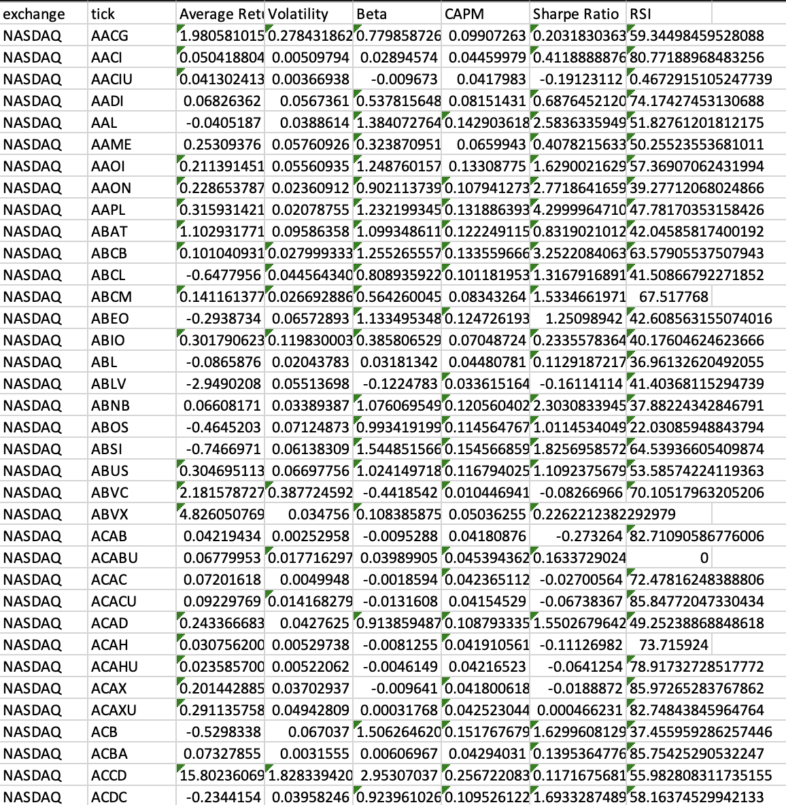
(Only NASDAQ is shown because of the way data is sorted)

The data was cleaned of any null values that it created (i.e. a stock with insufficient data). Next, we had to remove outliers from the data. These outliers consisted of stocks such as ACCD in the table above, which had significantly larger average return and volatility values. These trends can be associated with the large influx of investment in small and volatile bio-technology and pharmaceutical companies during the pandemic, which have now stabilized at significantly lower returns. In addition, this includes stocks with very randomnly large, and almost instantaneous increases in return and traded volume, likely due to the nature of high frequency trading bots exploiting the market inefficiencies. Furthermore, we wanted to eliminate stocks such as ACABU in Table 1, having an RSI of 0, which is an indication of continuous 14 day loss with no gain, or stagnation of price return as a whole. To do this, we calculated the z-scores for each data point at each feature and eliminated any data point that had a feature with a z-score feature greater than 3 (meaning that the point was farther than 3 standard deviations from the average of that particular feature for that data set), classifying it as an outlier assuming a normal distribution of the data. 

With all of this cleaning complete, we were left with 6273 stocks to use for our model.

## Methods
With the adequate data now obtained and features collected and cleaned, we could begin creating our model for finding stocks to utilize in portfolio creation. This started with running PCA on our feature data to reduced our features from six to a desired three to help with visualization. When we initially fit the PCA to the data, and transformed the data to fit the model, we found that 100% of the variance was explained by one feature. This, of course, is not suitable for visualizing the data and is likely explained by the significant variance in the RSI, which ranged from 8 to 100, while the ranges of other features were much smaller. To combat this, we normalized all of our data and re-ran PCA in order to get a better representation of features causing the variance. This yielded better results as the variance was now represented across three features instead of just one. These will be discussed later in our results section.

Once PCA created a usable visualization, we could run K-Means to identify clusters of stocks. To determine an adequate number of clusters for our data, we tracked the inertia of selecting *i* number of clusters ranging from 2 to 11, and chose the optimal number of clusters where the inertia no longer showed significant decrease. Once these cluster labels were created, we used them with the original data and found the average features for each cluster to try and identify key differences between the clusters. We then selected clusters of stocks which we believed are fit to create portfolios from. These portfolios are based on our own preferences of portfolio creation meaning high return, low risk, high sharpe ratio, and low RSI.

Finally, once we have the clusters of stocks we want to focus on, we will create an optimal portfolio using some of the stocks from those clusters. This will be done utilizing portfolio optimization techniques and the Python Portfolio Optimization Library. First, we can change the parameters of the data we want to look at within the selected clusters (for example, only using stocks that have positive returns and sharpe ratio greater than 1) depending on preference. Then, we will use an efficient frontier to create a minimum variance portfolio with the stocks provided in specific clusters we select. To create this efficient frontier we will use the historic prices for each stock from November 3rd, 2018 to November 3rd, 2023, the same range of dates we originally used for data collection. The efficient frontier is created using the average historical returns and a shrunk covariance matrix using the Ledoit Wolf method, which is commonly used in practical finance. We then find the point on this frontier that minimizes volatility, which will give us weights, or percentages of how much we should invest in each stock to minimize risk, while maximizing returns.

## Results and Discussion
After running PCA, our transformed data appeared as follows:

##### Figures 1 & 2: PCA Visualization
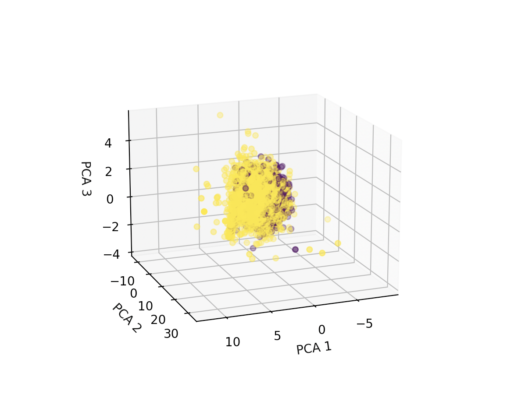 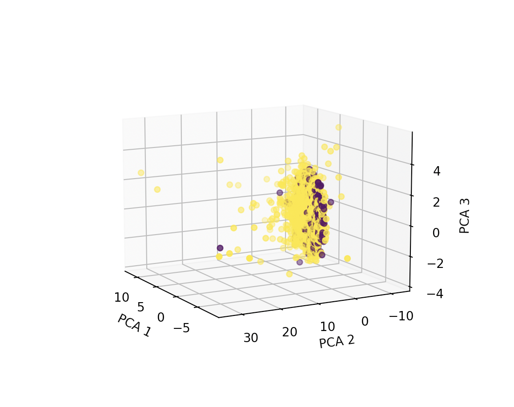

In Figures 2 & 3, the yellow points are stocks on the NASDAQ and the purple points are stocks on the NYSE. The explained variance for each principal component 1, 2, and 3 were 0.43968451, 0.26831039, 0.14900349 respectively. This means that principle component 1 primarily explains the variance in the data, which remains consistent with the visualization. We also see that there is a significant number of points all clustered around the same area on the coordinate plane at PCA 2 = 0, while others are dispersed more randomly where PCA 2 > 0. This is an indication that our data preprocessing did not get rid of all outliers of certain features relative to the rest of the data. However, this is not necessarily a problem considering we got rid of all outliers that couldn’t lie under a normal distribution. We also note that the majority of the points we can consider these ‘outliers’ lie on the NASDAQ, which remains consistent with the notion that equities listed on the NASDAQ tend to be more risky than equities listed on the NYSE. It is likely that the points lying within the cluster follow trends and exhibit features seen more typically in the market, while the ‘outliers’ deviate from these trends, which is a visualization of market ineffeciencies. However, because we do not know exactly what these 3 principle components mean, other than that they are orthogonal linear combinations of the 6 original features, we cannot draw further conclusions without looking at the original data along with these visualizations. Before we do that we will look at how the equities can be further put into clusters.

We first examined the inertias of selecting *i* numbers of clusters from 2 to 11. This is shown in the figure below:

##### Figure 3: Intertia for Clusters
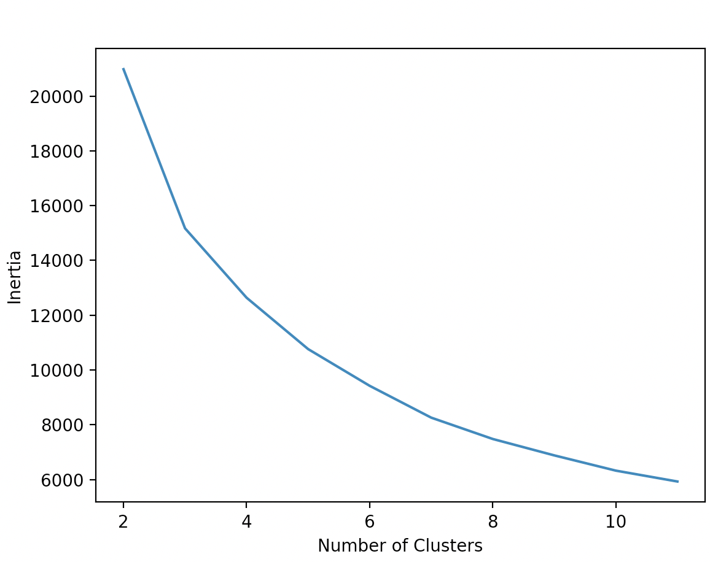

From this we see an ‘elbow’ where the inertia switched from exponential decrease to linear decrease at 6 clusters. Therefore, we decided that 6 numbers of clusters would be suitable for our needs. We can then observe what these clusters looked like in 2d for PCA 1 and 2, PCA 2 and 3, and PCA 1 and 3, as well as a 3d representation similar to that of original PCA visualization.

##### Figures 4, 5, 6 & 7: 2D PCA Visualizations
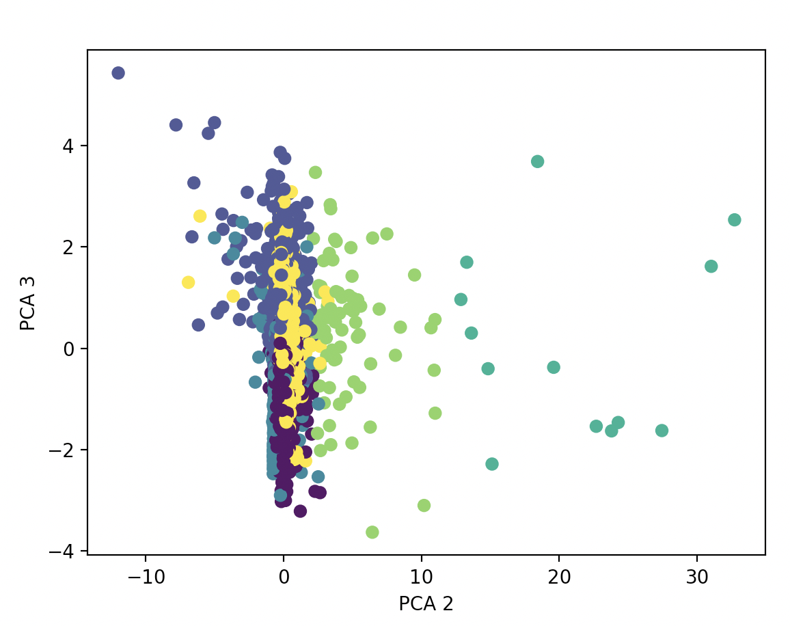 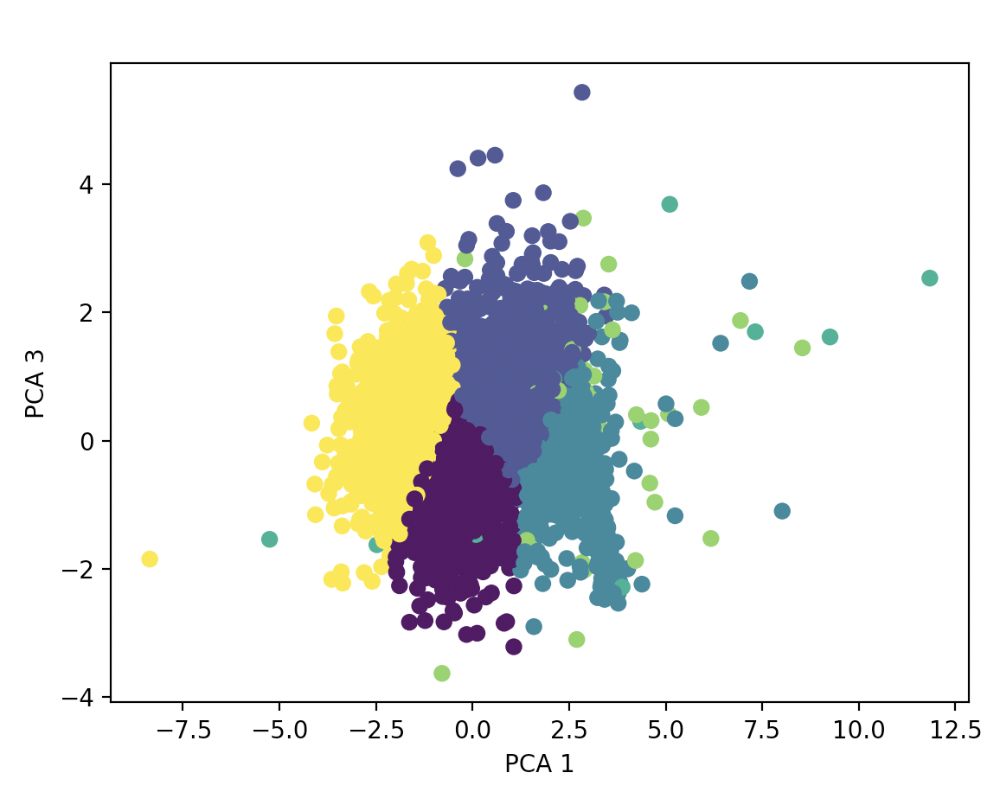
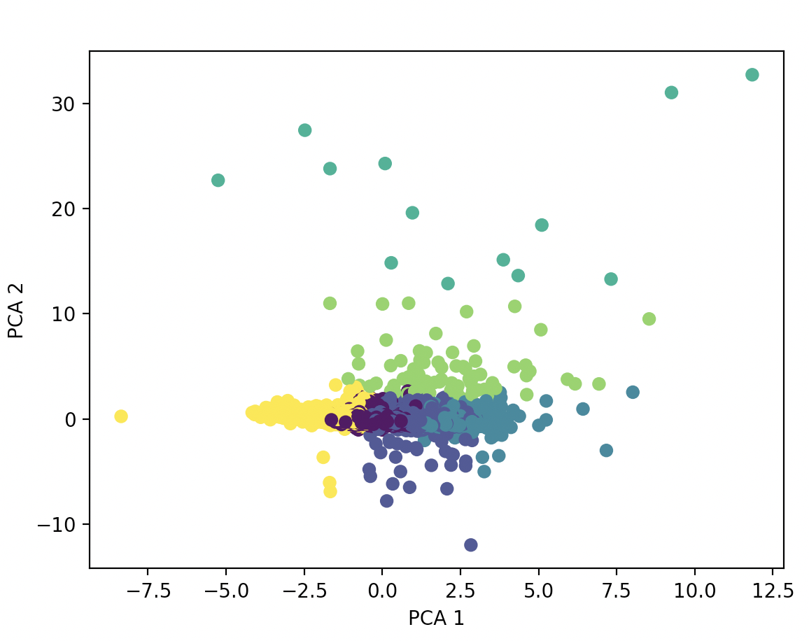 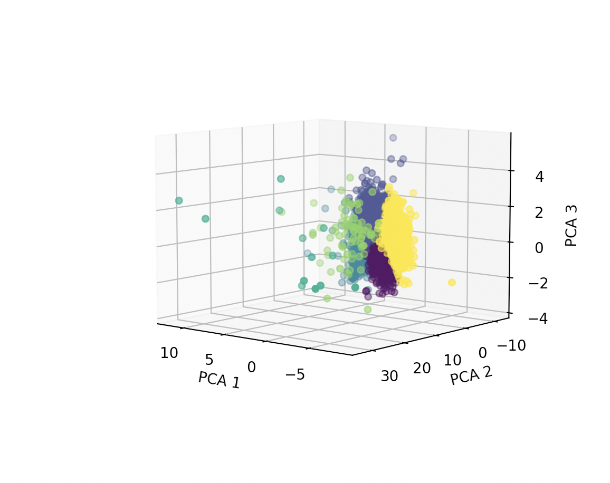

Now that we have the clusters, we can use the label to identify the key differences of each feature at each cluster.

##### Table 2: Feature Differences per Cluster
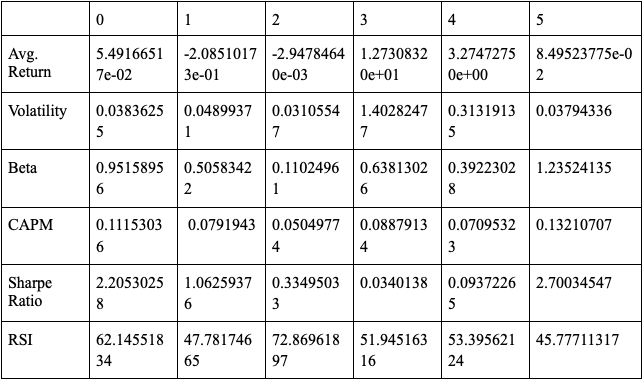

* Cluster 0: Moderate returns, low volatility, and a high Sharpe Ratio. The RSI indicates a slightly bullish trend.
* Cluster 1: Negative returns, moderate volatility, and a reasonable Sharpe Ratio. The RSI is below 50, indicating a bearish trend.
* Cluster 2: Near-zero returns, low volatility, and a low Sharpe Ratio. The RSI is high, indicating a bullish trend.
* Cluster 3: Outlier cluster with extremely high returns and volatility.
* Cluster 4: High returns, moderate volatility, and a modest Sharpe Ratio. The RSI is moderate, indicating a neutral trend.
* Cluster 5: Moderate returns, low volatility, and a high Sharpe Ratio. The RSI is below 50, indicating a bearish trend.

In this project, our goal is to maximize return, minimize volatility, maximize CAPM, maximize sharpe ratio, and minimize RSI. We can then use Beta to further analyze how the cluster will behave relative to the market.

##### Table 3: Each Cluster Relative to the Market
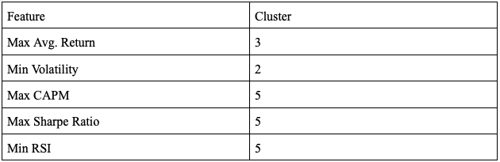

As stated cluster 3 has extremely high returns and high volatility. This cluster is a turquoise cluster in Figures 4, 5, 6, & 7, and is created with some of the ‘outliers’ described when looking at the results of the PCA. This cluster represents equities that yield returns on market inefficiencies. Therefore, this cluster should be discarded as it is not viable for long term investment strategies. The next highest returns are from clusters 4 and 5 respectively, however cluster 5 also maximizes the CAPM and sharpe ratio, and minimizes the RSI (indicating it is a good time to buy). Therefore, cluster 5 is selected to maximize returns at lower risk than cluster 4, while moving similarly to the market (indicated by a Beta near 1). Cluster two is then selected for further risk mitigation, as it has the lowest volatility, and near 0 average return.

Clusters 5 and 2 are then selected to build our portfolio off of. The efficient frontier is graphed below.

##### Figure 8: Efficient Frontier
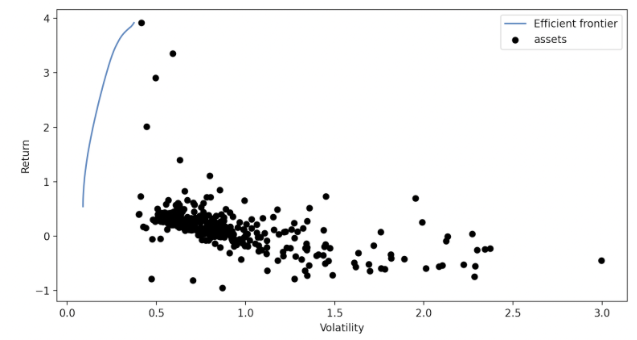

Since we sought out to create a minimum volatility portfolio, we can see in the graph that volatility is at its minimum around 50 percent return, therefore we can expect a return of around 50 percent from a minimum volatility portfolio using the stocks from clusters 5 and 2. The weights in order to achieve this are calculated next.

##### Table 4: Stock Portfolio Weights
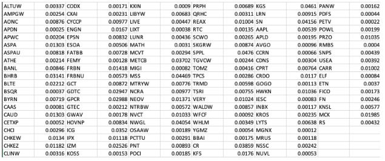

116 stocks were selected to invest in, all varying in industry, and having weights, or percentages, of how much to invest in each stock which sum to 1. The expected annual return of this portfolio is 54.3 percent with a volatility of 8.9 percent and a sharpe ratio 5.89. This is quite significant, as a sharpe ratio being above 3 is considered excellent for investing, and 54.3 percent return with only 8.9 percent volatility has significantly better performance than typical portfolios made by hand. In the next phase of the project, we will be utilizing supervised learning techniques to attempt to predict the performance of this portfolio over time to try and determine points of higher risk of loss.

## References
Dingming Wu, Xiaolong Wang, Shaocong Wu, “Construction of stock portfolios based on k-means clustering of continuous trend features”, Knowledge-Based Systems, Volume 252, 2022, 109358, ISSN 0950-7051.

R. Sahni, "Analysis of Stock Market Behaviour by Applying Chaos Theory," 2018 9th International Conference on Computing, Communication and Networking Technologies (ICCCNT), Bengaluru, India, 2018, pp. 1-4, doi: 10.1109/ICCCNT.2018.8494103.

X. Li and Z. Deng, "A Machine Learning Approach to Predict Turning Points for Chaotic Financial Time Series," 19th IEEE International Conference on Tools with Artificial Intelligence(ICTAI 2007), Patras, Greece, 2007, pp. 331-335, doi: 10.1109/ICTAI.2007.105.

Adil Moghar, Mhamed Hamiche, “Stock Market Prediction Using LSTM Recurrent Neural Network”, Procedia Computer Science, Volume 170, 2020, pp. 1168-1173, ISSN 1877-0509, https://doi.org/10.1016/j.procs.2020.03.049.

## Project Timeline
Here is a link to our project timeline as a Gantt Chart. If there is an issue with viewing the sheet please let us know but anyone should be able to view with just the link.

[Project Time Table](https://docs.google.com/spreadsheets/d/1u52pXjQm2g6DSqXZazK3U_52LHC-w85W/edit?usp=sharing&ouid=103164204269219948791&rtpof=true&sd=true)

## Contribution Table for Project Midterm Report
Alek Kaluza: KMeans Clustering, GitHub Page 
Logan Drawdy: Data Collection and Cleaning 
Eric Shavkin: PCA and Methods Writeup 
Olaolu Dada: Results Writeup and Visualizations 
Dom Fernando: KMeans Clustering and Visualization

## Checkpoint
**Final Report**
- Have supervised learning complete
- Provide more visuals to demonstrate stock prediction
